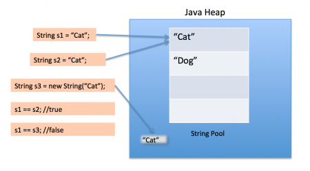

### 공부 주제

- Call by value와 Call by reference
- String & StringBuilder & StringBuffer
- PCB와 Context Switching (복습)
- 인터럽트와 시스템콜(복습)

## 질문

- Call by value와 Call by reference에 대해서 설명하세요
    

      
    - call by value : 
    call by value 호출 방식은 함수 호출 시 전달되는 변수 값을 복사해서 함수 인자로 전달한다.
        - 장점 : 복사하여 처리하기 때문에 안전하다. 원래의 값이 보존된다.
        - 단점 : 복사를 하기 때문에 메모리 사용량이 늘어난다.
    - call by reference :
    함수 호출 시 인자로 전달되는 변수의 레퍼런스를 전달한다. 따라서, 함수 안에서 인자 값이 변경되면, Argument로 전달된 객체의 값도 변경된다. 
        - 장점 : 복사하지 않고 직접 참조를 하기에 빠르다.
        - 단점 : 직접 참조를 하기에 원래 값이 영향을 받는다.
      
    

- Java의 함수 호출 방식에 대해 설명하세요

    

    자바의 경우, 항상 **call by value**로 값을 넘긴다.

    C/C++와 같이 변수의 주소값 자체를 가져올 방법이 없으며, 이를 넘길 수 있는 방법 또한 있지 않다.

    reference type(참조 자료형)을 넘길 시에는 해당 객체의 주소값을 복사하여 이를 가지고 사용한다.

    따라서, **원본 객체의 프로퍼티까지는 접근이 가능하나, 원본 객체 자체를 변경할 수는 없다.**
      
    

- Java의 함수 호출 방식에 대해 설명하세요
    

    변수를 조작했는데, 의도와 다르게 원본 값이 바뀌거나, 반대로 바뀌지 않은 경우가 있을 수 있다. 언어적 특성을 이해하는데 도움이 된다.
    

- 그렇다면 파이썬은 Call by value일까요 ? Call by reference일까요?
    

    - call by assignment 
        - immutable object일 경우 call by value형식으로 핸들링
        - mutable object일 경우 call by reference 형식으로 핸들링
        - 파이썬의 함수 인자 호출 방식은 인자로 받는 객체의 자료형에 따라 다르다.
    
    

- new String() 과 리터럴 (””)의 차이에 대해 설명해주세요
    

    - new String()은 new 키워드로 새로운 객체를 생성하기 때문에 Heap 메모리 영역에 저장되고,
    - “” 는 Heap 안에 있는 String Constant Pool 영역에 저장된다.
    
    
    

- String 객체가 불변인 이유에 대해 아는대로 설명해주세요
    

    1. 캐싱 기능에 의한 메모리 절약과 속도 향상
        - Java에서 String 객체들은 Heap의 String Pool이라는 공간에 저장되는데, 참조하려는 문자열이 String Pool에 존재하는 경우 새로 생성하지 않고, Pool에 있는 객체를 사용하기 때문에 특정 문자열 값을 재사용하는 빈도가 높을 수록 상당한 성능향상을 기대할 수 있다.
    2. Thread-safe
        - String객체는 불변이기 때문에 여러 스레드에서 동시에 특정 String 객체를 참조하더라도 안전하다.
    3. 보안 기능
        - 중요한 데이터를 문자열로 다루는 경우, 강제로 해당 참조에 대한 문자열 값을 바꾸는 것이 불가능하기 때문에 보안에 유리하다.
    

- String, StringBuffer, StringBuilder 클래스의 각각의 특징에 대해 설명하세요

    

      
    ### String

    - new 연산을 통해 생성된 인스턴스의 메모리 공간은 변하지 않음 (Immutable)
    - Garbage Collector로 제거되어야 함.
    - 문자열 연산시 새로 객체를 만드는 Overhead 발생
    - 객체가 불변하므로, Multithread에서 동기화를 신경 쓸 필요가 없음. (조회 연산에 매우 큰 장점)
    
    ### StringBuffer, StringBuilder
    
    - 공통점
        - new 연산으로 클래스를 한 번만 만듬 (Mutable)
        - 문자열 연산시 새로 객체를 만들지 않고, 크기를 변경시킴
        - StringBuffer와 StringBuilder 클래스의 메서드가 동일함.
    - 차이점
        - StringBuffer는 Thread-Safe함 / StringBuilder는 Thread-safe하지 않음 (불가능)

    

- float a = 0.1 는 오류가 발생하는가?

    

    발생한다.

    float a = 0.1f로 코드를 바꿔야한다. 0.1뒤에 d가 생략되어있다. 자바는 실수의 default value는 double이기 때문이다.

    

- 캐스팅이 필요한 이유는?

    

    
    1. **다형성** : 오버라이딩된 함수를 분리해서 활용할 수 있다.
    2. **상속** : 캐스팅을 통해 범용적인 프로그래밍이 가능하다.
    
        
     ‘캐스팅을 통해 범용적인 프로그래밍이 가능하다.’ 위의 말을 예시를 들어 설명가능한가?
      
  
        class Animal{
        	
        	public void run() {
        		System.out.println("Animal....");
        	}
        }
        
        class Tiger extends Animal{
        	
        	@Override
        	public void run() {
        		System.out.println("Tiger....");
        	}
        }
        
        class Cat extends Animal{
        	
        	@Override
        	public void run() {
        		System.out.println("Cat....");
        	}
        }
        
        class Rabbit extends Animal{
        	
        	@Override
        	public void run() {
        		System.out.println("Rabbit....");
        	}
        }
        
        public class JavaTest {
        	
        	public static void printAnimals(Animal[] animals) {
        		for(Animal a : animals) {
        			a.run();
        		}
        	}
        	
        //	public static void printTiger(Tiger tiger) {}
        //	public static void printCat(Cat cat) {}
        //	public static void printRabbit(Rabbit rabbit) {}
        	
        	public static void main(String[] args) {
        		Animal tiger = new Tiger();
        		Animal cat = new Cat();
        		Animal rabbit = new Rabbit();
        		
        		Animal[] animals = {tiger, cat, rabbit};
        	
        		printAnimals(animals);
        	}
        	
        }

    

- 다운캐스팅에서 주의해야할 점
    

    다운 캐스팅 특성에 대해 주의해야 할 이유는 에디터에서 컴파일 에러가 발생하기 않고 런타임 에러가 발생하는 위험성이 있기 때문
    

